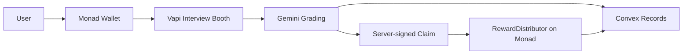

# Architecture

IQlify is an AI voice interview practice app with onchain rewards on Monad.

## Layers

| Layer | Location | Responsibility |
|-------|----------|----------------|
| UI | `apps/web` | Next.js routes, interview UX, wallet flows |
| API | `apps/web/app/api` | Vapi webhooks, grading, reward signing |
| Backend | `convex/` | Users, interviews, transactions, leaderboard |
| Onchain | `apps/contracts` | Reward distributor on Monad testnet |
| Shared types | `packages/domain` | Interview and reward domain models |
| Network config | `packages/config` | Monad RPC, chain IDs, explorer URLs |
| Reward client | `packages/monad-rewards` | Claim helpers and contract bindings |

## Core user flow (target)

## Intentionally deferred

Out of scope for the initial scaffold:

- Leaderboards
- Challenges and entry fees
- Multi-language UI (add after core loop works)
- Certificates and PDF exports
- MiniPay-specific integrations

Ship the core loop first: **interview → grade → claim**.
